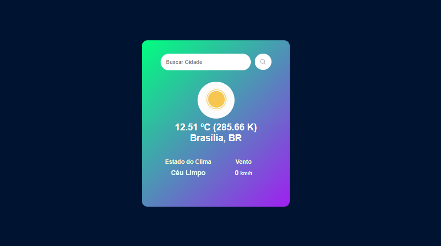

# EasyWeather ⛅
EasyWeather é uma aplicação web que fornece previsões meteorológicas precisas e em tempo real. Nosso objetivo é oferecer aos usuários informações claras e confiáveis sobre o clima em qualquer lugar do mundo.
- Versão do Projeto: **v1.1**
- Pre-Visualização do Projeto: [Website Easy Weather](https://easy-weather-web-site.vercel.app/)



## Features 🎉
- Troca de ícone do site atualizada.
- Adaptação para melhor visualização em dispositivos celulares.

## Funcionalidades ✨
- Tempo em Graus Celcius;
- Estado do Clima;
- Velocidade do Vento.

## Tecnologias Utilizadas 💻
- Frontend: HTML, CSS, JavaScript
- API: [OpenWeatherMap API](https://openweathermap.org/api)


## Instalações 🔌
Clone o repositório:

```sh
git clone https://github.com/DevVictor02/Easy-Weather.git
```

Navegue até o diretório do projeto:

```sh
cd easyweather-website
```

## Como Utilizar 🔨
- Acesse o site EasyWeather.
- Digite o nome da cidade na barra de pesquisa.
- Veja a previsão do tempo detalhada e atualizada.

## Contribuição 🤝
Contribuições são bem-vindas! Se você tiver sugestões ou encontrar algum problema, por favor, abra uma issue ou envie um pull request.

## Como Contribuir ❓
Fork o repositório.
Crie uma branch para sua feature:
```sh
git checkout -b minha-nova-feature
```
Commit suas mudanças:
```sh
git commit -m 'Adiciona nova feature'
```
Envie para a branch principal:
```sh
git push origin minha-nova-feature
```
Abra um pull request.

## Contato 🎁
- Me adicione no Discord: bruhpereiraa
